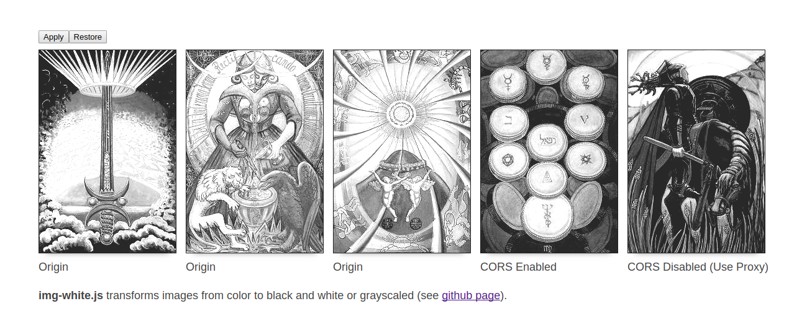

# img-white

A script that turns images on a webpage from color to black-and-white / grayscale.

- Works for images on origin
- Works for images with CORS enabled
- Works for images with CORS disabled (trying out one or more proxy)
- **Doesn't work** for `file:///`
- Images are changed through `src` so events for img elements still hold
- Has sane but tweakable defaults
- Has the following settings:
  - Tweak the black & white filter through `brightness`, `contrast`, `black_threshold`, and `white_threshold`
  - Element selector (e.g. "img", "img.white", etc)
  - Select CORS proxy (e.g. `http://cors-anywhere.herokuapp.com/`, `http://crossorigin.me/`, `http://cors.io/?u=`)
- You can restore filtered images to their original state with `White.restore()`
- See demo at [http://01automonkey.github.io/img-white/](http://01automonkey.github.io/img-white/)

## ToDo

- implement black and white *bottom* threshold
- NPM and Bower package.
- Support more image sources than the img tag (e.g. css background-image)
- **Bug:** In Chrome sometimes when adding an image to the page with `.innerHTML`, you can't call `White.run()` immediately after or you get a cross-origin error, one way to get around it is to call it inside a `setTimeout` that's set to 0.

## How to Use

- Add the script to body: ``
- Call `White.run("img")`
- You can also change the following variables before calling `.run()`:
  - `White.proxy = ["http://cors-anywhere.herokuapp.com/", "http://crossorigin.me/", "http://cors.io/?u="];`
  - `White.selector = "img";`
  - `White.brightness = 33;`
  - `White.contrast = 50;`
  - `White.black_threshold = 40;`
  - `White.white_threshold = 255;`
- And to restore the images back to their original state, call `White.restore();`
- You can also run the script using only the script tag by adding `?run=true` to the src URI
- You can also set options through the script src URI (such as `?run=true&selector=img.white&brightness=50`)
- The simplest way to apply it to your site is: `https://cdn.rawgit.com/01AutoMonkey/img-white/master/bin/white.min.js?run=true`

## Prior Art

Heavily inspired by and based on http://www.html5rocks.com/en/tutorials/canvas/imagefilters/
